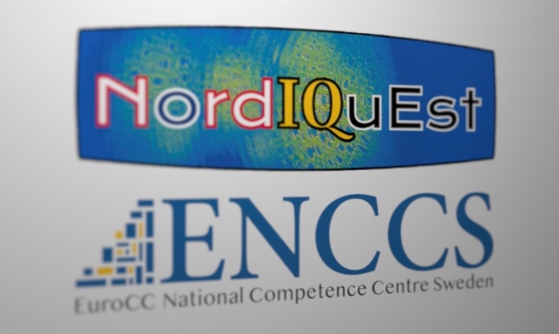

# Introduction to Quantum Computing Hybrid HPC-QC Systems



## Table of Contents
1. [Description](#description)
2. [Information](#information)
3. [Installation](#installation)
4. [Certificate](#certificate)

<a name="descripton"></a>
## Description

Recent developments in quantum technology are bringing the world closer to a new technological revolution – the advent of usable quantum computers able to provide enormous acceleration to important computational tasks. In the coming years, quantum computing is expected to have a huge impact on practically all areas of research that can utilize computational modeling.

The NordΙQuEst project brings together a consortium of seven partners from five Nordic and Baltic countries to connect world-leading traditional HPC resources and quantum computers across national borders with the aim of establishing a quantum computing platform customized to the needs of the region.

ENCCS joined forces with NordIQuEst to deliver two-day training workshops covering the fundamentals of quantum computing (QC), including:
> - Introduction to key concepts: quantum states, qubits, quantum algorithms;
> - QC programming in high-level languages for use cases in optimization, finance, and quantum chemistry followed by testing quantum programs to ensure their correctness;
> - Overview of the main QC hardware approaches;
> - Integration of QC with classical computing: hybrid classical/quantum algorithms and HPC-QC systems;
> - Introduction to quantum software testing with Quito tool;

<a name="information"></a>
## Information

All necessary information, links, lesson slides, and exercises for the workshop can be found [on the workshop website](https://hackmd.io/@enccs/qcomp-june2022) and on the workshop [on the workshop repository](https://enccs.github.io/NordIQuEst-workshop/)

Workshop moment 1          |  Workshop moment 2
:-------------------------:|:-------------------------:
  |  

<a name="installation"></a>
## Installation

It is strongly recommended to install all dependencies inside a virtual environment. Here are instructions for using the `conda` package manager.

The following packages are needed:

- python=3.9
- numpy
- matplotlib
- jupyterlab
- qiskit
- qiskit[visualization]
- pylatexenc
- r-base=3.6
- r-tidyverse
- rpy2
- [Quito](https://github.com/Simula-COMPLEX/quito)

### Anaconda/miniconda

If you do not already have an Anaconda or miniconda installation on your computer, download and install miniconda (a smaller distribution than Anaconda) by following the [official documentation](https://docs.conda.io/en/latest/miniconda.html).

With a working Anaconda/miniconda installation, you can now create a new conda environment with all the required packages by:

```console
$ conda env create -f https://raw.githubusercontent.com/ENCCS/NordIQuEst-workshop/main/environment.yml
```

Before using the environment you need to activate it:

```console
$ conda activate qcomp
```

### Quito

First, clone the repository:

```console
$ git clone https://github.com/Simula-COMPLEX/quito.git
```

To use Quito one calls directly the script
`python quito/Quito_CoverageRunning/quito.py`.

### Exercises

All exercises are contained in Jupyter notebooks.

1. Create a new Jupyter notebook using JupyterLab. Copy-paste code cells from the hands-on episodes of this lesson. Edit as needed and run.
   
2. Clone this repository to access the complete notebooks:

   ```console
   $ git clone https://github.com/ENCCS/NordIQuEst-workshop.git
   $ cd NordIQuEst-workshop/content/notebooks
   $ jupyter-lab
   
<a name="certificate"></a>
## Certificate
The certificate can be found [here](https://github.com/HROlive/Introduction-to-Quantum-Computing-Hybrid-HPC-QC-Systems/blob/main/images/certificate-hugo-oliveira.pdf).
